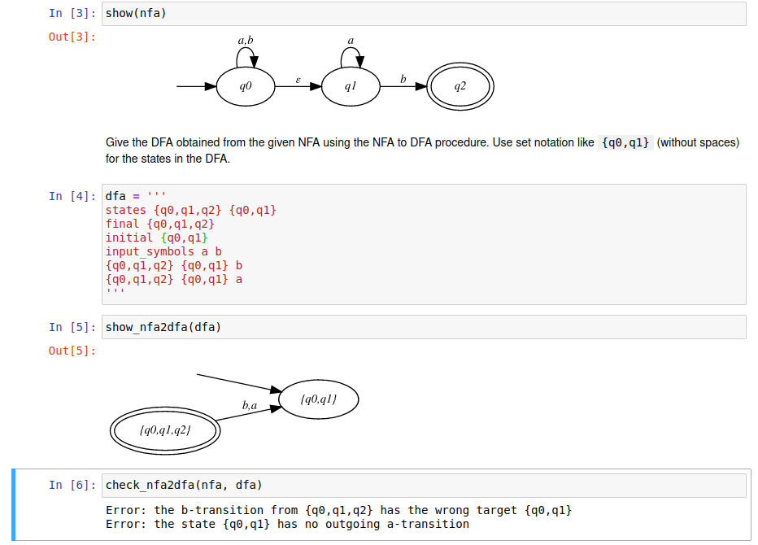

# GAMBA tools

The `gambatools` package is a Python 3 package that aims to
support education in theoretical computer science at
[Eindhoven University of Technology](https://www.tue.nl/en/).
It contains a library for
DFAs, NFAs, PDAs, Turing machines, context free grammars and
regular expressions. Moreover, the package provides Jupyter notebooks with
exercises. The library has been developed by Wieger Wesselink,
and it was designed together with Erik de Vink.

# GAMBA
The code was developed as part of the GAMBA project, which stands for:
*Grammars and Automata Made Boffo and Assessible*. The goals of the project are
to support

* practising and assessing formal language techniques
* self-paced learning outside contact hours
* immediate feedback while practising
* automated grading for assessment 

(*boffo*: extremely successful, sensational)

# License
The code is distributed under the `GPL-3.0-or-later` license.

# Installation
The package can be installed using
```
pip install gambatools
```
The required python packages can be found in `requirements.txt`.

# Rendering images
For visualization the [graphviz](https://pypi.org/project/graphviz/) python
package is used. **To render the generated DOT source code, you also need to install
Graphviz**. See the [Graphviz website](https://graphviz.org/) for further instructions.
Make sure that the directory containing the `dot` executable is on your systems’ path. 

# Documentation
The file `doc/specifications.pdf` contains formal specifications
of the algorithms in the library. Note that the code maps almost one-to-one
to the specifications, so in order to understand the code please consult the
pseudocode specifications.

# Notebooks
The directory `notebooks` contains a number of Jupyter notebooks
with exercises. In `notebooks/with-answers` the correct answers are
already given, while in `notebooks/without-answers` they have been
left out. 
The answers to the exercises are checked automatically.
Whenever the user makes a mistake, appropriate feedback is given.



For specifying a DFA, NFA, etc. a line based textual input format is used,
see the example below. The documentation contains a section that describes
the syntax, while in the `examples` directory a number of examples can be found.
```
input_symbols 0 1
states qA qB qC qD

initial qA
final qC

qA qB 0
qA qD 1
qB qB 0
qB qC 1
qC qB 0
qC qC 1
qD qD 0
qD qD 1
```

# Notebook generation
For convenience there is a mechanism to automatically generate notebooks from
templates.
The notebooks in `notebooks/with-answers` and `notebooks/without-answers`
have been generated using the commands
```
make_notebook.py -o without-answers notebooks.batch
make_notebook.py --with-answers -o with-answers notebooks.batch
```
The templates contain tags of the form `<<tag>>` that are substituted by
the `make_notebook.py` script. This generation is still experimental, and
there is currently no documentation available for this.

# Contact
If you are interested in using the package for education or have questions
or feedback, the authors can be reached by email:
<e.p.d.vink@tue.nl> or <j.w.wesselink@tue.nl>.
